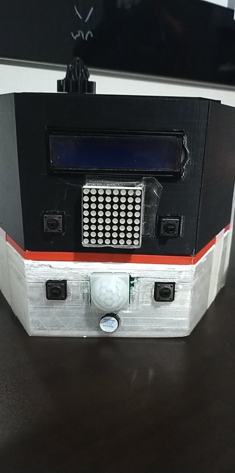
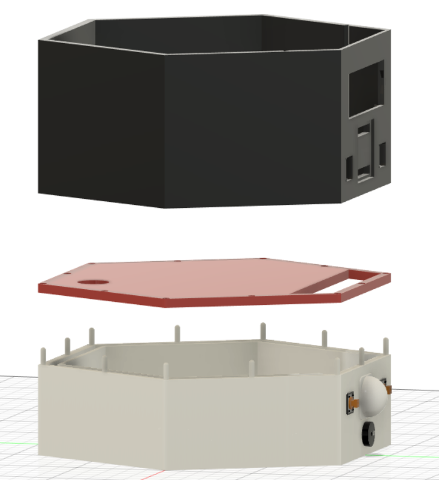
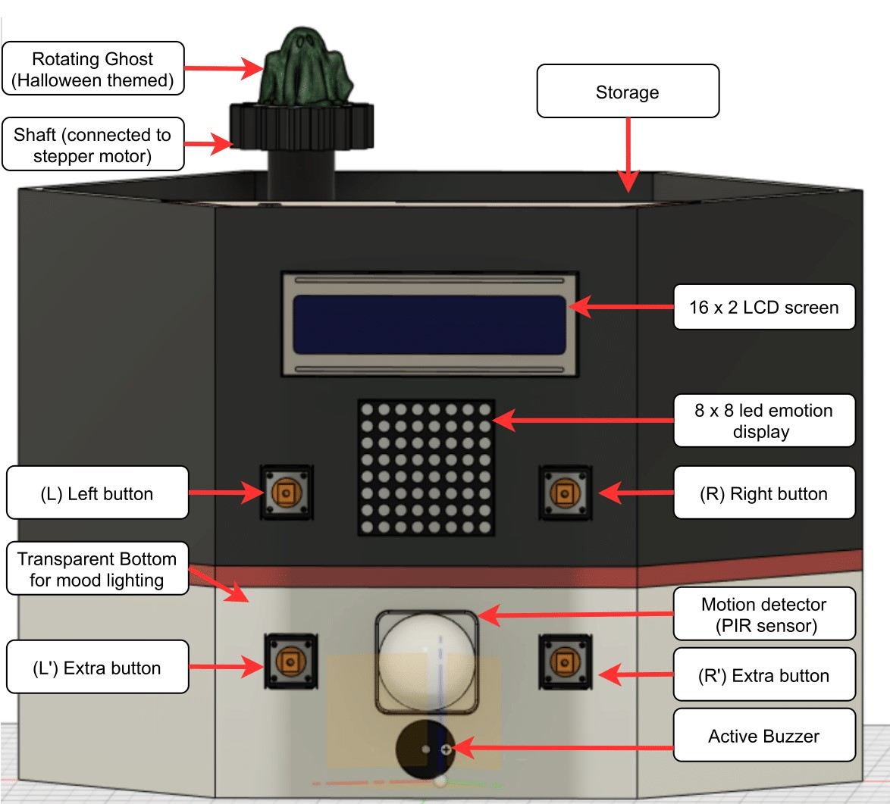
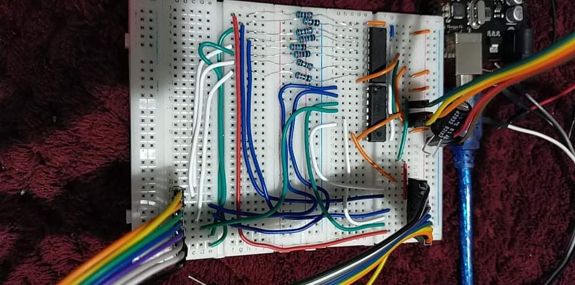

# Study Buddy

By:\
Mukul Chodhary  - 1172562\
Matthew Webb    - 1234019\
Mustafa Behrami - 1153524

# VIDEO

[VIDEO](ESI_Project/blob/main/WED_09-00_G2_VID.mov)

## Motive
The study buddy is a smart timer that we created to tackle lockdown studying issues such as phubbing and procrastination. Especially now with the onset of Netflix's newest series Squid Game and new seasons of Lucifer and You, our time management abilities are struggling to cope with the plethora of stimuli being thrown at our brains.

Our project tackles this issue by implementing the pomodoro technique to split work over 25 minute intervals separated by 5 minute breaks. This method rewards effort and progress and has been useful in our university studies previously.

Our plan is to utilise a master slave configuration to overcome pin limitations of a single arduino to connect 4 buttons, an LCD screen, PIR sensor, 8*8 LED matrix and an active buzzer to create the most complete study tool you’ll ever need.

### Physical implementation and 3D design

The study buddy was designed with 90’s theme in the back of our mind. The colour scheme, hexagonal shape are the artifacts of that. Autodesk Fusion 360, a computer aided design tool,  was used to design and create the casing. PLA plastic was used to 3D print the study buddy. We decided to go with 3D printer approach, instead of traditional materials like wood because of its ease of reproducibility and real time error fixability. PLA plastic was chosen as our preferred filament for 3D printing over ABS, due to environmental and health concerns. Unlike ABS,  PLA is biodegradable, recyclable, and doesn’t produce any hazardous fumes when melted during printing process. 
Printing and designing prototypes this way is also cost-effective and lets anyone reproduce the product without many difficulties. 

The design of study buddy is modular. It’s made up of three main parts. The top black section, the middle red section and bottom white section. 

The top section contains main user interface, which are : 1 LCD screen capable of displaying 2 lines of 16 characters. 1 8by8 led matrix used to display emotions to make the interaction more human. Two buttons to interact with the system. The user interface is quite simple and intuitive to use. Top section also contains some storage space for your phone, some stationary and maybe some treats !
The middle section splits top and bottom section. This also provides floor for top storage section. 
The bottom section is where both Arduinos live, as well as one DS1302 clock module, stepper motor and its driver, as well as a custom driver for 8by8 led matrix.  and all the wirings. 

More technical viewers might be interested in why we need two Arduinos, and what is this custom driver for 8b8 led matrix. 8by8 led matrix has 16 pin inputs, LCD display requires 12 pin inputs to operate and that’s already too many pins for 1 Arduino to handle. Therefore, we decided to use 2 Arduinos and established an I2C communications between them. 

The master Arduino is connected to all of sensors which are motion sensor (PIR) to detect when user is nearby, Photoresistor (to detect when lights are off),  two user buttons to get input from user, an active buzzer to alert user when timer has ended, and stepper motor for the rotating figure. 
The slave Arduino is responsible for displaying messages to both displays. 16 by 2 LCD screen requires 8 pins to go directly to Arduino and the rest 4 are some combination of VCC and GND pins. But this was still too many pins, as 8by8 led matrix required 16 pins to connect. To reduce number of pins we cascaded 2 8 bit shift registers and created a 16 bit shift register.

This meant we can manipulate 16 pins input to 8 by 8 using only 3 input pins of a shift register. This made our task somewhat manageable. However, the original pins from 8by8 led module were not nicely sorted into rows and columns, so additional wire rerouting had to be done. The driver circuit was built on a breadboard for this project. 

We also recycled some broken garden lights to add warm mood lightings. 

  
